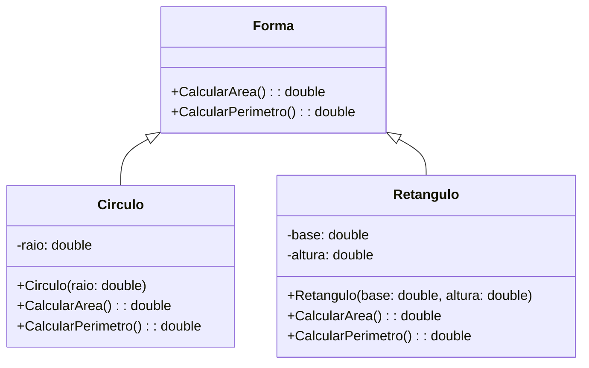
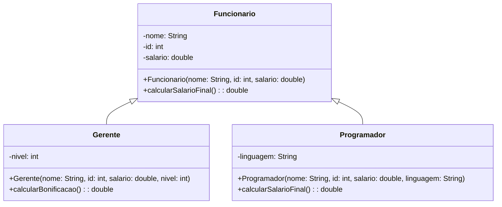
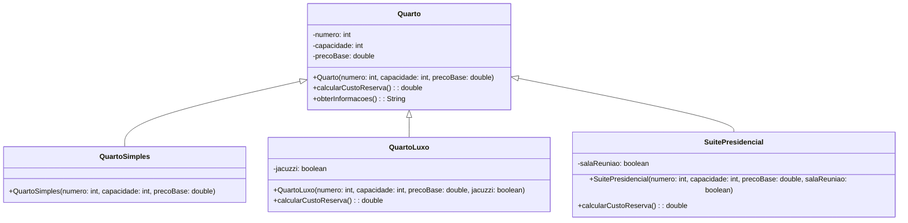

# Sistema de Gerenciamento - Atividade

## Questão 1 - Formas Geométricas

### Diagrama de Classe



### Exemplo de Uso

```java
Scanner leia = new Scanner(System.in);
System.out.println("Digite o raio do círculo: ");
double value = leia.nextDouble();

Circulo c1 = new Circulo(value);
c1.CalcularPerimetro();

System.out.println("Área do círculo: " + c1.CalcularArea() + "\nPerímetro do círculo: " + c1.CalcularPerimetro());

Retangulo r1 = new Retangulo(16, 4);
System.out.println("Área do retângulo: " + r1.CalcularArea() + "\nPerímetro do retângulo: " + r1.CalcularPerimetro());
```

## Questão 2 - Sistema de Gerenciamento de Funcionários

### Diagrama de Classe



### Exemplo de Uso

```java
Programador pro1 = new Programador("Livia", 0, 1330.00, "Java");
System.out.println("Salário final do programador: " + pro1.calcularSalarioFinal());

Gerente gere1 = new Gerente("JoycinhaXD", 1, 2200.00, "Finanças", 3);
System.out.println("Bonificação do gerente: " + gere1.calcularBonificacao());
```

## Questão 3 - Sistema de Reservas em Hotel

### Diagrama de Classe



### Exemplo de Uso

```java
QuartoSimples qs1 = new QuartoSimples(123, 30, 100.00);
System.out.println(qs1.obterInformacoes());

QuartoLuxo ql1 = new QuartoLuxo(124, 50, 200.00, false);
QuartoLuxo ql2 = new QuartoLuxo(124, 50, 200.00, true);

System.out.println("Quarto de luxo 1: " + ql1.obterInformacoes());
System.out.println("Quarto de luxo 2: " + ql2.obterInformacoes());

SuitePresidencial sp1 = new SuitePresidencial(124, 50, 500.00, false);
SuitePresidencial sp2 = new SuitePresidencial(124, 50, 500.00, true);

System.out.println("Suíte Presidencial 1: " + sp1.obterInformacoes());
System.out.println("Suíte Presidencial 2: " + sp2.obterInformacoes());
```