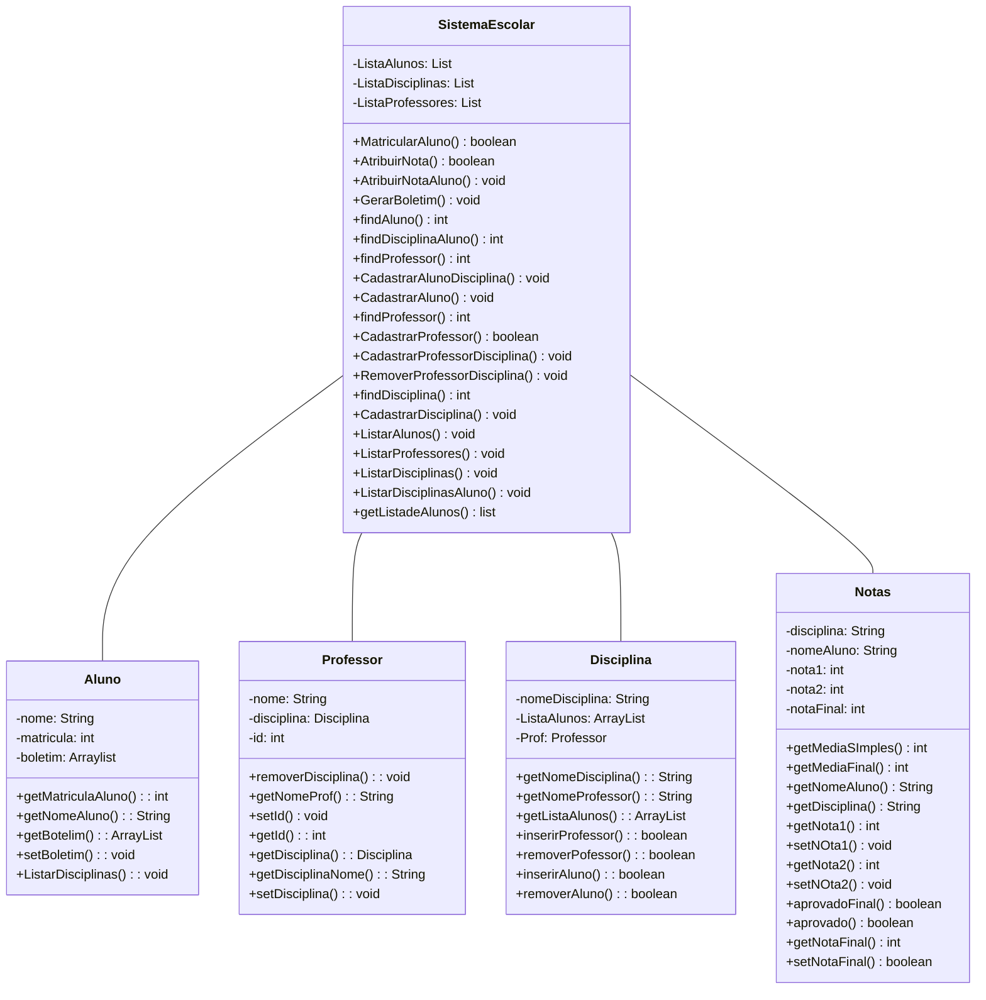

# Sistema Escolar - Projeto Final de PEOO

Este é o projeto final desenvolvido na disciplina de Programação Estruturada Orientada a Objetos (PEOO), denominado Sistema Escolar. O sistema foi elaborado para gerenciar informações relacionadas a alunos, professores, disciplinas e notas em um ambiente escolar.

Aluna: Livia Vitória da Silva.
Aluno: Ryan Pinheiro Alves.

## Estrutura do Projeto

### Classes

#### 1. Aluno
A classe representa um aluno e inclui atributos como nome, matrícula e boletim (lista de notas). Métodos estão disponíveis para acessar e manipular essas informações, como obter a matrícula, nome, boletim, listar disciplinas, etc.

#### 2. Disciplina
Esta classe representa uma disciplina, com atributos como nome, lista de alunos matriculados e professor responsável. Métodos estão implementados para inserir e remover professores e alunos, além de obter informações sobre a disciplina.

#### 3. Notas
A classe Notas gerencia as notas de um aluno em uma disciplina específica. Possui métodos para calcular médias, verificar aprovação e acessar as informações relacionadas às notas.

#### 4. Professor
A classe Professor representa um professor, com atributos como nome, disciplina associada e ID. Métodos estão disponíveis para gerenciar a associação do professor com uma disciplina.

#### 5. SistemaEscolar
A classe principal, responsável por gerenciar listas de alunos, disciplinas e professores. Oferece métodos para realizar diversas operações, como matricular aluno, atribuir notas, cadastrar disciplinas, professores, listar informações, entre outras.

# Sistema Escolar - Funcionalidades Principais

1. **Cadastrar Disciplina (Opção 1):**
   - Permite cadastrar uma nova disciplina no sistema.

2. **Cadastrar Professor (Opção 2):**
   - Facilita o cadastro de um novo professor no sistema.

3. **Cadastrar Aluno (Opção 3):**
   - Permite registrar um novo aluno no sistema.

4. **Associar Professor a Disciplina (Opção 4):**
   - Cria uma associação entre um professor e uma disciplina.

5. **Associar Aluno a Disciplina (Opção 5):**
   - Associa um aluno a uma disciplina específica.

6. **Remover Professor de Disciplina (Opção 6):**
   - Remove a associação de um professor a uma disciplina.

7. **Visualizar Professores (Opção 7):**
   - Exibe a lista de todos os professores cadastrados.

8. **Visualizar Alunos (Opção 8):**
   - Mostra a lista de todos os alunos cadastrados.

9. **Visualizar Disciplinas (Opção 9):**
   - Exibe a lista de todas as disciplinas cadastradas.

10. **Gerar Boletim (Opção 10):**
    - Gera o boletim de um aluno, mostrando as notas em todas as disciplinas.

11. **Atribuir Nota a Aluno (Opção 11):**
    - Facilita a atribuição de notas a um aluno em uma disciplina específica.

## Diagrama de Classes.

## Utilização.

O projeto pode ser utilizado como uma base para sistemas de gerenciamento escolar, oferecendo funcionalidades essenciais para a administração de alunos, professores, disciplinas e notas.

## Contribuições

Contribuições são bem-vindas! Sinta-se à vontade para propor melhorias, correções ou novas funcionalidades.

**Agradecemos por utilizar o Sistema Escolar!**